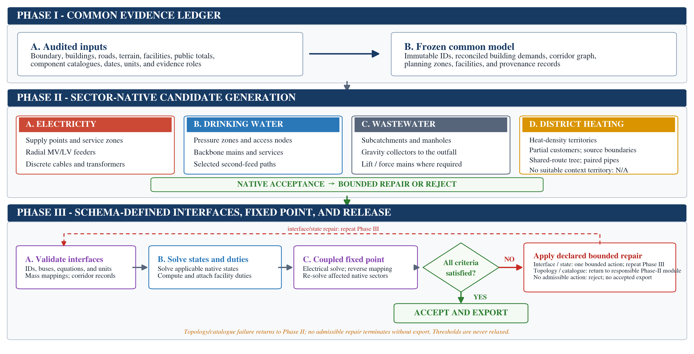

# Urban4

**Reproducible generation and coupling of urban infrastructure networks**

Urban4 generates aligned electricity, drinking-water, wastewater, and optional
district-heating networks from one geospatial evidence model. Each sector keeps
its own topology, component sizing rules, and native solver. Explicit interface
records connect powered facilities and preserve building-level water-to-sanitary
mappings.



Urban4 is intended for transparent, reproducible infrastructure studies. The
generated networks are evidence-conditioned synthetic models. They are not
maps of confidential installed utility assets.

## Main capabilities

- Creates four sector-specific networks over the same buildings and urban
  extent.
- Exports pandapower, EPANET/WNTR, SWMM, and pandapipes models.
- Stores machine-readable cross-sector interface contracts.
- Applies predefined engineering acceptance criteria and bounded repairs.
- Runs a coupled benchmark and two water-power disturbance cases.
- Retains evidence roles, solver results, repair records, and output hashes.

## Repository structure

```text
Urban4/
├── urban4/                 # Core generation, coupling, and solver modules
├── cases/                  # Case configuration and declared assumptions
├── data/raw/               # Retained OpenStreetMap evidence snapshots
├── scripts/                # Reproduction, audit, export, and figure scripts
├── tests/                  # Unit, integration, and result-consistency tests
├── reference_results/      # Compact verification records
├── docs/                   # Method and reproducibility documentation
├── run_all.py              # Complete code-and-results workflow
├── pyproject.toml
└── requirements-verified.txt
```

## Installation

Urban4 v2.9.0 was verified with Python 3.12. Create a clean environment and
install the exact direct dependencies used for the verified release run:

```bash
python -m venv .venv
source .venv/bin/activate
python -m pip install --upgrade pip
python -m pip install -r requirements-verified.txt
```

On Windows PowerShell, activate the environment with:

```powershell
.venv\Scripts\Activate.ps1
```

## Reproduce the study

From the repository root, run:

```bash
python run_all.py
```

This command regenerates the topology cases, native-solver models, interface
records, coupled benchmark, disturbance cases, figures, audits, tests, and
checksums. Generated files are written to `outputs/` and `figures/`. These directories are
intentionally excluded from routine Git history because they are reproducible
and substantially larger than the source.

To refresh the retained OpenStreetMap snapshot before running the study, use:

```bash
python run_all.py --refresh-osm
```

Refreshing the snapshot changes the evidence vintage and therefore does not
reproduce the verified release. The retained files in `data/raw/` should be
used for exact comparison with v2.9.0.

## Verified release result

The v2.9.0 verification reports 83 passed tests and no failures. It preserves
the complete v2.8.0 equation corrections and uses the operator-reported water
service population of approximately 100,000 inhabitants for the DVGW W 410
hourly factor. The exact result is 2.610228786; the native EPANET design-hour
check conservatively rounds it upward to 2.62. That same factor is enforced in
the building ledger and pipe pre-sizing, preventing stale geometry from an
earlier factor. The Harmon wastewater peak
factor and 1,600 district-heating full-load hours are unchanged. All four
municipality-scale models satisfy their declared acceptance criteria.

The documented GKS CHP is now represented once as a shared electricity and
district-heating asset. Its default contract is availability-only, with no
inferred dispatch or conversion curve, so it does not change the verified
benchmark operating point.

The executed main-waterworks feeder outage disconnects the pump supply path.
The native water-model rerun delivers approximately 0.009% of demand. Only the
explicitly executed water consequence is claimed for that event.

See [the verification record](docs/VERIFICATION_v2.9.0.md), the
[equation audit](docs/EQUATION_AUDIT.md), and
[the compact reference results](reference_results/README.md) for details.

## Evidence and data

The retained geospatial snapshots were retrieved from OpenStreetMap through
the Overpass API on 27 July 2026. They are included so the retained release run does not depend on a changing
live map. Public utility totals and source references
are declared in `cases/schweinfurt.json`.

The code contains no confidential utility geometry, private customer records,
tariffs, plant dispatch, control policies, or proprietary equipment
nameplates. See [data provenance and licensing](data/README.md).

## Optional integrations

Urban4 can consume exports from InfraNet DB and pyLOVO when those tools are
available. They are not required for the retained-snapshot reproduction. See
[the integration documentation](docs/INFDB_INTEGRATION.md).

## Citation

If you use Urban4 or its generated benchmark models, cite this software release.
Machine-readable citation metadata are provided in [`CITATION.cff`](CITATION.cff).

## Licences

Urban4 source code is released under the [MIT License](LICENSE). The retained
OpenStreetMap snapshots remain © OpenStreetMap contributors and are available
under the Open Database License. Other cited public sources retain their
original terms.
